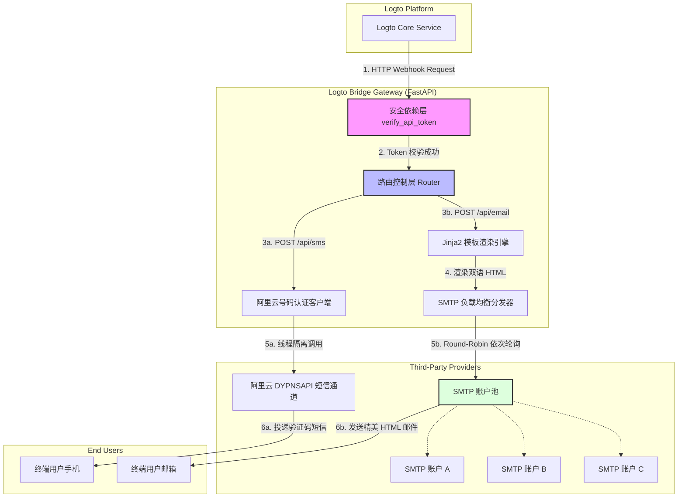

# Logto Bridge Gateway 🚀

[](https://fastapi.tiangolo.com)
[](https://www.python.org)
[](https://www.docker.com)
[](LICENSE)

`Logto Bridge Gateway` 是一个**轻量、高效、高可用**的第三方账户/网关桥接服务。专为 [Logto](https://logto.io) 身份认证平台定制，解决其无法直接对接国内主流短信供应商（如**阿里云号码认证服务**）或需要高可靠性**多 SMTP 账号负载均衡发送邮件**的痛点。

本项目将 Logto 发出的标准化 HTTP Webhook 格式请求，透明、安全地桥接转换为目标供应商 API 规范，并内置强大的容灾与隐私保障机制。

---

## 🎯 核心特性

*   **⚡ 异步高并发底座**：基于 **FastAPI + Uvicorn** 全异步生态构建，使用 `aiosmtplib` 异步发送邮件，配合 `asyncio.to_thread` 线程隔离调用阿里云 SDK，防止任何同步 IO 阻塞事件循环。
*   **💬 阿里云号码认证短信集成**：全面对接阿里云**号码认证服务 (DYPNSAPI)**，调用 `SendSmsVerifyCode` 接口，支持对 Logto 自动生成的验证码直接透传、有效期换算，并提供手机号中间 4 位日志脱敏。
*   **✉️ SMTP 负载均衡与自动故障转移 (Failover)**：支持在配置文件中挂载多个不同的 SMTP 账户。发送邮件时，在多协程并发安全下通过 **Round-Robin (轮询)** 算法分配账户；当某个账户发生网络超时、频控或认证失败时，**静默容灾自动漂移**至下一个可用节点，直至完整遍历账户池，保证用户注册登录流绝不断网。
*   **🎨 极其精美的响应式 HTML 邮件模板**：使用 Jinja2 引擎动态渲染邮件。遵循现代响应式 UI 设计（宽 600px 内联样式，深海蓝渐变 Header `#0A192F` -> `#172A45`，高质感卡片），支持**中英双语 (zh-CN / en)** 根据 Logto 请求体中的 `locale` 自动匹配，并针对不存在的模板提供优雅降级。
*   **🔒 严密的安全隔离与合规审计**：
    *   **安全防线**：所有 API 均强校验 `Authorization: Bearer <Token>` 或 `X-Bridge-Token`，拦截未经授权的匿名访问。
    *   **零泄露日志流**：严格执行日志脱敏（Sanitization），禁止在日志中打印验证码、激活链接、SMTP 密码及未脱敏的收件地址/手机号。
*   **🛠️ 完美的容灾降级开关 (`always_return_2xx`)**：在网关后端服务彻底不可用时（例如阿里云欠费、全部 SMTP 节点全部宕机），可配置开启该降级模式，强行对 Logto 返回 2xx 成功响应，从而避免 Logto 注册认证前端出现报错弹窗，最大化保护用户体验。

---

## 📐 架构设计与数据流拓扑

以下是 `Logto Bridge Gateway` 的核心架构及 Webhook 请求流向拓扑：



---

## 📂 项目目录指引

```text
logto-bridge/
├── app/
│   ├── __init__.py
│   ├── server.py             # FastAPI 实例创建、生命周期 lifespan 管理与健康检查
│   ├── api/                  # API 路由与安全网关层
│   │   ├── deps.py           # 全局安全令牌认证依赖校验 (verify_api_token)
│   │   ├── email.py          # 接收 Logto 邮件 Webhook，执行 Jinja2 渲染并分发
│   │   └── sms.py            # 接收 Logto 短信 Webhook，适配投递至阿里云
│   ├── core/                 # 核心系统支撑
│   │   ├── config.py         # 统一 TOML 配置管理与环境变量合并重写 (Pydantic v2)
│   │   └── logging.py        # 全局统一日志格式，提供可观测性基础
│   ├── integrations/         # 三方 SDK 与通道集成
│   │   ├── email.py          # 封装 SMTP Round-Robin 轮询与 Failover 自动容灾
│   │   └── sms.py            # 封装阿里云号码认证 SDK 线程池隔离异步调用
│   └── templates/            # 多语言 HTML 邮件模板文件夹
│       ├── zh-CN/            # 简体中文邮件模板 (SignIn.html, Register.html 等)
│       └── en/               # 英文邮件模板
├── config/
│   ├── config.toml           # 生产环境配置文件 (由 config.example.toml 复制重命名)
│   └── config.example.toml   # 官方标准 TOML 配置模板
├── tests/                    # 单元与集成测试套件
├── Dockerfile                # 基于多阶段构建的轻量化生产 Docker 镜像配置
├── docker-compose.yml        # 一键容器化编排部署文件
├── pyproject.toml            # 基于 PEP 621 的 Python 项目依赖与打包规范
└── AGENTS.md                 # 仓库 AI/Agent 开发最高准则与红线规范
```

---

## 🚀 快速开始

### 方案一：使用现代包管理器 `uv`（推荐，速度极快）

1.  **克隆仓库**：
    ```bash
    git clone https://github.com/molyleaf/logto-bridge.git
    cd logto-bridge
    ```

2.  **创建虚拟环境并安装依赖**：
    ```bash
    uv venv --python 3.12
    # 激活虚拟环境 (Windows)
    .venv\Scripts\activate
    # 激活虚拟环境 (Linux/macOS)
    source .venv/bin/activate
    
    # 安装全部依赖（含开发依赖）
    uv pip install -e ".[dev]"
    ```

3.  **准备配置文件**：
    将样例配置复制为正式配置文件，并按照下文的 [配置指南](#-配置指南) 进行修改：
    ```bash
    copy config\config.example.toml config\config.toml
    ```

4.  **启动开发服务器**：
    ```bash
    uvicorn app.server:app --reload --port 8000
    ```
    启动后可访问本地交互式文档：[http://127.0.0.1:8000/docs](http://127.0.0.1:8000/docs)。

---

### 方案二：使用传统 `pip`

1.  **安装依赖**：
    ```bash
    pip install -r requirements.txt
    pip install -e ".[dev]"
    ```
2.  **启动服务**：
    ```bash
    uvicorn app.server:app --port 8000
    ```

---

### 方案三：使用 Docker / Docker Compose（推荐生产环境）

本项目已将配置文件移出镜像，仅通过挂载或环境变量重写，最大程度保证镜像的安全性。

1.  **构建并拉起容器**：
    ```bash
    docker-compose up -d --build
    ```

2.  **查看服务运行日志**：
    ```bash
    docker-compose logs -f logto-bridge
    ```

3.  **健康检查**：
    内置了针对 Docker 探针的本地轻量化接口 `/healthz`。可通过以下命令验证网关存活状态：
    ```bash
    curl http://localhost:8000/healthz
    ```

---

## 🛠️ 配置指南

所有的配置项集中在 `config/config.toml` 中。以下是核心配置项深度解析：

```toml
# ==============================================================================
# Logto Bridge 生产环境配置文件
# ==============================================================================

# 桥接器安全令牌。来自 Logto 的 Webhook 请求头中必须携带 Bearer Token 或 X-Bridge-Token
api_token = "your-extremely-secure-api-token-here"

# 阿里云号码认证服务（DYPNSAPI）配置，用于发送短信验证码
[sms.alicloud]
access_key_id = "LTAI5tXxxxxxxxxxxxxxxxxx"
access_key_secret = "xxxxxxxxxxxxxxxxxxxxxxxxxxxxxx"
endpoint = "dypnsapi.aliyuncs.com" # 号码认证服务默认服务端点
sign_name = "我的APP" # 号码认证控制台审核通过的签名（不支持普通短信签名）
template_code = "SMS_200000000" # 控制台审核通过的系统模板
code_length = 6 # 验证码长度 (4-8 位)，默认为 6
valid_time = 300 # 验证码有效时间（秒），默认为 300 秒（5分钟）
always_return_2xx = false # 短信发送彻底失败时，是否强行返回 2xx，保障前端流不中断（默认 false）

# 邮件发送全局配置
[email]
always_return_2xx = false # 所有邮件服务器发送失败时，是否强行返回 2xx，保障前端流不中断（默认 false）

# 负载均衡多 SMTP 发送账户池（依次轮询且故障自动转移）
[[email.smtp_accounts]]
host = "smtp.primary-email.com"
port = 465 # SSL/TLS 加密端口
username = "sender1@primary-email.com"
password = "primary_smtp_password"
use_tls = true # 强制使用 SSL/TLS 加密
sender_email = "security@primary-email.com"
sender_name = "安全中心"

[[email.smtp_accounts]]
host = "smtp.backup-email.com"
port = 587 # StartTLS 加密端口
username = "sender2@backup-email.com"
password = "backup_smtp_password"
use_tls = false # 不强制 TLS，通过 StartTLS 协商
sender_email = "no-reply@backup-email.com"
sender_name = "系统通知"
```

### 💡 环境变量覆盖（Docker 环境最佳实践）

为了防止敏感凭证（如阿里云密钥及 SMTP 密码）写入配置文件导致泄漏，本项目支持环境变量最高优先级覆盖：

*   `BRIDGE_API_TOKEN`：覆盖根配置中的 `api_token`。
*   `BRIDGE_SMS_ACCESS_KEY_ID`：覆盖 `sms.alicloud.access_key_id`。
*   `BRIDGE_SMS_ACCESS_KEY_SECRET`：覆盖 `sms.alicloud.access_key_secret`。

---

## 📖 API 接口契约规范

### 1. 安全校验头 (Authentication)
所有接收端点均强制拦截未鉴权请求。Logto 的 Webhook 连接器配置中必须加入以下两种请求头之一：

*   方式一：`Authorization: Bearer <api_token>`（推荐）
*   方式二：`X-Bridge-Token: <api_token>`

---

### 2. 短信网关接口：`POST /api/sms`

由 Logto HTTP 短信连接器触发的报文格式：

*   **请求体示例 (JSON)**:
    ```json
    {
      "to": "+8613800138000",
      "type": "SignIn",
      "payload": {
        "code": "837492",
        "locale": "zh-CN"
      },
      "ip": "192.168.1.100"
    }
    ```

*   **处理成功响应 (200 OK)**:
    ```json
    {
      "status": "success",
      "message": "SMS sent successfully via AliCloud",
      "requestId": "908C86EF-4F58-5BE8-BD79-DFD111667EA5"
    }
    ```

---

### 3. 邮件网关接口：`POST /api/email`

由 Logto HTTP 邮件连接器触发的报文格式。网关将依据 `payload.locale` 加载对应的双语 HTML 模板，并传入验证码等参数进行渲染。

*   **请求体示例 (JSON)**:
    ```json
    {
      "to": "user@example.com",
      "type": "Register",
      "payload": {
        "code": "482094",
        "locale": "en",
        "link": "https://auth.example.com/verify?token=xyz"
      },
      "ip": "192.168.1.100"
    }
    ```

*   **处理成功响应 (200 OK)**:
    ```json
    {
      "status": "success",
      "message": "Email rendered and sent successfully via load-balanced SMTP pool"
    }
    ```

---

## 🎨 HTML 邮件模板矩阵

系统支持多种身份认证场景，模板统一存储在 `app/templates/{locale}/{type}.html` 中。支持的业务类型矩阵如下：

| `type` 业务类型 | 中文邮件标题 | 英文邮件标题 | 场景描述 |
| :--- | :--- | :--- | :--- |
| `SignIn` | 登录身份验证码 | Sign In Verification Code | 登录、二次身份校验 |
| `Register` | 欢迎注册 - 身份验证码 | Welcome - Registration Verification Code | 注册新账户 |
| `ForgotPassword` | 重置密码 - 验证安全码 | Reset Password Verification Code | 找回或更改账户密码 |
| `OrganizationInvitation` | 您已获邀加入组织 | Organization Invitation | 邀请用户加入组织，支持透传 `link` |
| `BindNewIdentifier` | 绑定新账号 - 验证安全码 | Bind New Identifier - Verification Code | 绑定新手机号或邮箱 |
| `MfaVerification` | 多因素身份验证 (MFA) - 验证安全码 | Multi-Factor Authentication (MFA) - Verification Code | 触发二次多因素身份校验 |
| `TestConnection` | Logto 邮件服务连接测试成功 | Logto Mail Connector Test Successful | 在 Logto 控制台中测试邮件连接器连通性 |

> [!TIP]
> **优雅的模板降级机制**：若 Logto 发送了自定义的非标 `type` 模板请求，网关会自动静默降级为通用 `SignIn` 基础模板进行动态加载与渲染，杜绝因为模板文件缺失而直接向 Logto 抛出 5xx 异常，从而最大限度地保障线上认证链路的高可用性。

---

## ⚖️ 开源许可证

本项目基于 **MIT License** 开源。详情参见 [LICENSE](LICENSE) 文件。
